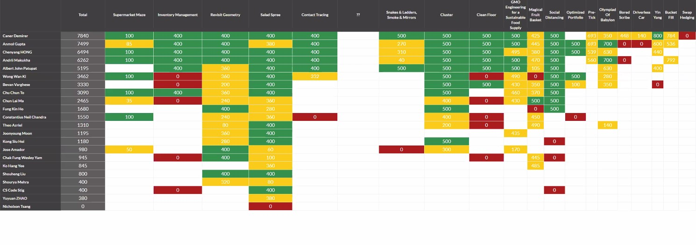

# Hello world!

As someone who just began doing competitive programming questions, this 24H challenge is disturbingly a great cause to make you an insane person for one whole day pun intended. Unlike **Codeforces** and **Codechef**, you are not only have to figure out the more efficient algorithms for each respective problems, but you have setup and deploy your code (in my case it's _python_ and wrap it with _flask_ and _gunicorn_) to _Heroku_ and at the least had to make sure you are treating the corrent input (JSON or text) and lastly _jsonify_ the **return** value.

Too bad but not too bad, I managed to fight up the ladder and ended up at the _11th pos_ of the individual Hong Kong leaderboard. For you who are in the penultimate year and below, this challenge is definitely a _yes yes_.

## Example Usage

These instruction are to help you solve a test challenge "Calculate Square". Instruction to this test challenge can be found at https://calculate-square.herokuapp.com/instructions

### Step by step

As per the instruction you have to implement a post endpoint /square

- Go to `square.py` under `codeitsuisse/routes` folder in this template and you will find a post method with name  `/square` 
- write your implementation in this method. This method will be the entry point when you submit your solution for evaluation
- Note the __init__.py file in each folder. This file makes python treat directories containing it to be loaded in a module
- Follow similar approach to implement actual challenges during the event
